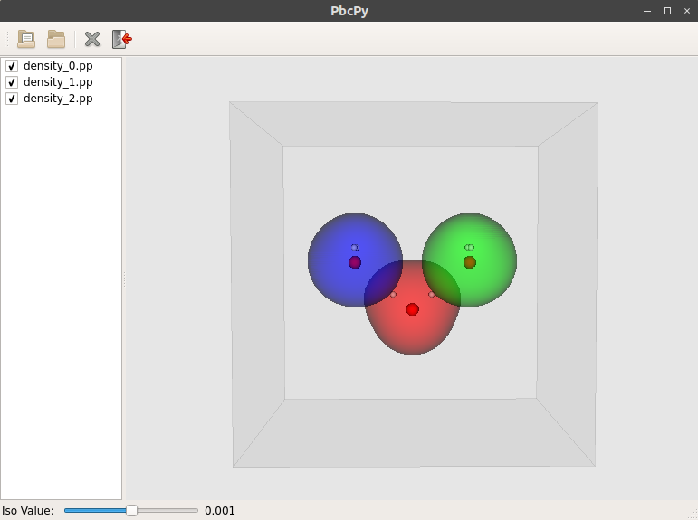

# PbcPy-GUI

This is the proof of concept of a graphical user interface for the [PbcPy](https://github.com/alesgenova/pbcpy) library I wrote. It is an experiment for me to play around with `Qt5` and `VTK`.

For now, the GUI can only display electron densities obtained from Quantum Espresso (`.pp` files) through a simple drag and drop action.

- Interface: [PyQt5](https://www.riverbankcomputing.com/software/pyqt/download5)
- Rendering: [VTK](https://www.vtk.org/)

